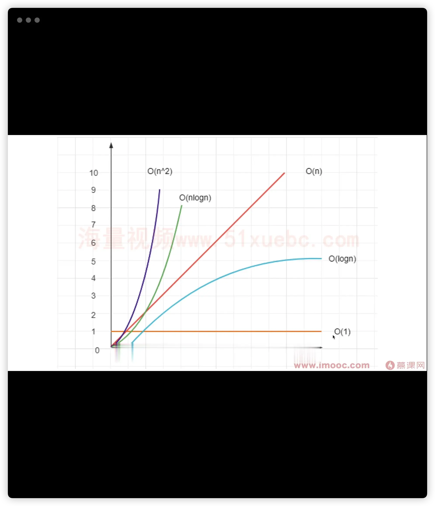

# interview-100
前端面试100道题详解

## 1. 数据结构和算法
- 算法复杂度: 空间/时间
- 算法思维: 贪心/二分/动态规划
- 常见数据结构
注: 一个问题的解决方案有很多,要找出最优解

### 算法复杂度
 - 什么是复杂度
    程序执行时需要的计算量(时间)和内存空间(空间);
    复杂度是`数量级`,不是具体的数字;
    一般针对一个具体的算法,而非一个完整的系统;
    
 - 时间复杂度
 - 空间复杂度